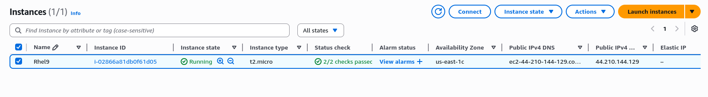
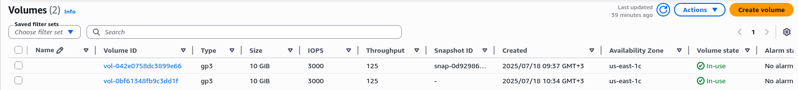

# Note-Taking Web App on AWS EC2

## Project Overview
This project deploys a simple note-taking web application on an AWS EC2 instance using Python Flask and MariaDB, with a backup solution using an additional EBS volume.

## Architecture
- **Web Application**: Python Flask
- **Database**: MariaDB
- **Server**: AWS EC2 (t2.micro, RHEL 9)
- **Backup**: EBS Volume mounted at /backup

## Components

### 1. EC2 Instance Setup
- RHEL 9 t2.micro instance
- Security groups allowing ports 22 (SSH) and 80 (HTTP)
- Key pair for SSH access




### 2. Web Application
A simple Flask application that allows users to:
- Write and submit notes
- View previously submitted notes with timestamps


### 3. MariaDB Configuration
- Database: notesdb
- Table: notes (id, content, created_at)
- User: notesuser with appropriate permissions


### 4. Backup Solution
- Additional EBS volume mounted at /backup
- Daily backup script using mysqldump
- Persistent mount using UUID in /etc/fstab


## Installation and Setup

### System Dependencies
```bash
sudo dnf update -y
sudo dnf install python3 git mariadb mariadb-server -y
pip3 install flask pymysql
```

### Database Setup
```bash
sudo systemctl enable mariadb
sudo systemctl start mariadb
sudo mysql_secure_installation

# Database creation
mysql -u root -p
CREATE DATABASE notesdb;
USE notesdb;
CREATE TABLE notes (
    id INT AUTO_INCREMENT PRIMARY KEY,
    content TEXT NOT NULL,
    created_at TIMESTAMP DEFAULT CURRENT_TIMESTAMP
);

# Create dedicated user
CREATE USER 'notesuser'@'localhost' IDENTIFIED BY 'password123';
GRANT ALL PRIVILEGES ON notesdb.* TO 'notesuser'@'localhost';
FLUSH PRIVILEGES;
EXIT;
```


### EBS Volume Setup for Backup
```bash
# Check available disks
lsblk

# Format the volume (assuming /dev/xvdf)
sudo mkfs -t xfs /dev/xvdf

# Create backup directory
sudo mkdir -p /backup

# Mount the volume
sudo mount /dev/xvdf /backup

# Get UUID for persistent mount
UUID=$(sudo blkid /dev/xvdf | awk -F'"' '{print $2}')

# Add to fstab for persistent mounting
echo "UUID=\"$UUID\" /backup xfs defaults 0 0" | sudo tee -a /etc/fstab
```

## Verification Steps

### Web Application
- Access via http://[EC2-PUBLIC-IP] (in my case it was 44.210.144.129)
- Add notes and verify they appear with timestamps

### Database
- Verify data is being stored in MariaDB
- Check table structure and contents

### Backup System
- Verify EBS volume is mounted correctly
- Check backup files are being created
- Test restore capability
